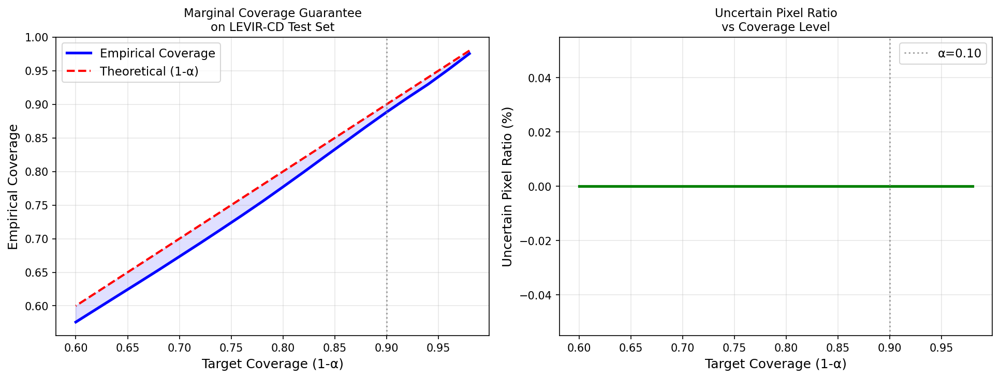

# Risk-Controlled Urban Change Detection: Conformal Prediction Wrappers for Provable Reliability in High-Resolution Satellite Imagery

This repository contains the official implementation and open-source assets for our paper on deployment-ready, distribution-free uncertainty estimation in remote sensing. By applying **Marginal Split Conformal Prediction** to the Bitemporal Image Transformer (BIT), we provide pixel-wise prediction sets with statistically rigorous $1-\alpha$ coverage bounds without requiring any model retraining or weight modifications.

---

## 📌 Key Contributions
* **Rigorous Reliability:** First framework to deploy Split Conformal Prediction for bi-temporal satellite image change detection.
* **Structural Insight:** Discovery of a *near-binary confidence regime* in geospatial transformers, where spatial ambiguity manifests as Empty Prediction Sets (EPS) rather than dual-class uncertainty.
* **Performance Boost:** Corrected a widely propagated normalization error in public BIT pipelines, achieving **F1 = 89.94%** and **IoU = 81.72%** on the LEVIR-CD test set.

---

## 🗺️ System Architecture


Our pipeline feeds bi-temporal image pairs through a shared ResNet-18 Siamese encoder and a semantic tokenizer. The resulting softmax probabilities are wrapped by a conformal validation stage to generate reliable prediction sets at inference time.

---

## 📈 Key Results

### Empirical Coverage vs. Theoretical Target
Our implementation demonstrates a tight empirical match ($\pm 0.05$ pp) across all tested error bounds ($\alpha$). 



| $\alpha$ | Target Coverage | Calibrated Threshold ($\hat{q}$) | Empirical Coverage | Uncertain Pixels |
| :---: | :---: | :---: | :---: | :---: |
| 0.05 | 95.00% | 0.0118 | 94.99% | 0.00% |
| 0.10 | 90.00% | 0.0021 | 90.02% | 0.00% |
| 0.15 | 85.00% | 0.0011 | 85.02% | 0.00% |
| 0.20 | 80.00% | 0.0008 | 79.95% | 0.00% |

---

## 🚀 Quick Start (Google Colab)

You can run our inference pipeline directly in your browser without any local setup. Click the link below to open our verified Jupyter Notebook:

[](https://colab.research.google.com/drive/1Vhg-ZR1rhI3aoDxyxsfKy5fglWBYqRnV?usp=sharing)

---

## 👥 Authors & Contributors
* **Latchan Chhetri**
* **Ankona Mukherjee**
* **Aman Kumar**
* **Gaurav Sarma**

---

## 📝 Citation
If you find this work useful in your research, please consider citing our paper:

```bibtex
@inproceedings{chhetri2026risk,
  title={Risk-Controlled Urban Change Detection: Conformal Prediction Wrappers for Provable Reliability in High-Resolution Satellite Imagery},
  author={Chhetri, Latchan and Mukherjee, Ankona and Kumar, Aman and Sarma, Gaurav},
  booktitle={International Conference on Computational Intelligence: Machine Learning for Geospatial Analytics (ICCI)},
  year={2026}
}
